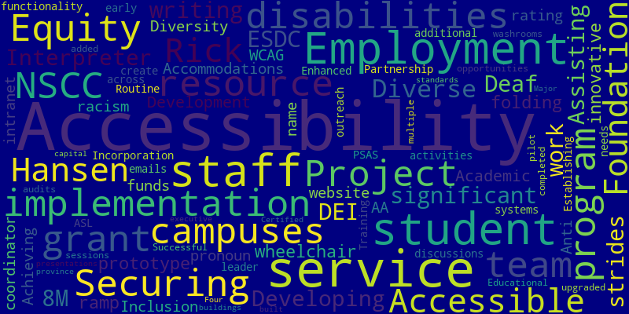
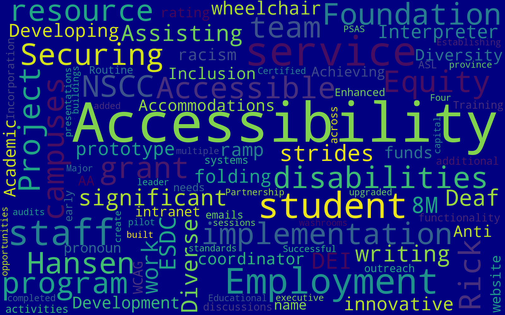

# 📘 NSCC Accessibility Plan Evaluation

**Capstone Project | NSCC – April 2025**  
**Department: HREI (Human Rights, Equity and Inclusion)**

## 🏫 Academic Information

- **Institution:** Nova Scotia Community College (NSCC)  
- **Program:** IT – Data Analytics  
- **Course:** INFT3000 – Capstone  
- **Instructor:** George Campanis  
- **Term:** Winter 2025

## 🔍 Overview

This project was developed as part of the *Capstone* course at NSCC, in collaboration with the Human Rights, Equity and Inclusion (HREI) department. The main goal was to evaluate the NSCC Accessibility Plan, which outlines 55 institutional commitments to improving accessibility across college operations.

The work involved categorizing, visualizing, and analyzing the commitments data, with a focus on accessibility, clarity, and stakeholder engagement. Deliverables included interactive dashboards and visual reports created with accessible design principles, as well as data processing and analysis tasks.

## 🎯 Key Deliverables

- Spreadsheet of 55 commitments (raw and cleaned versions)
- Gantt Chart with the deliverables deadline
- Project Charter with the summary document defining project goals, scope, stakeholders, and timeline
- Team Structure chart
- Interactive reports using **Tableau Public**  
- Accessible visual report prototypes with varied layouts and color palettes  
- Word cloud created with **Python**, based on a celebratory text  
- Summary of lessons learned and future recommendations  

## 🛠️ Tools & Technologies

- **Tableau** – for data visualization and reporting  
- **Python** – for text analysis and word cloud visualizations  
- **Excel/Spreadsheets** – for data source cleaning and structure  
- **Toggl** – for time tracking and project planning

## 📊 Accessibility Dashboard Overview

